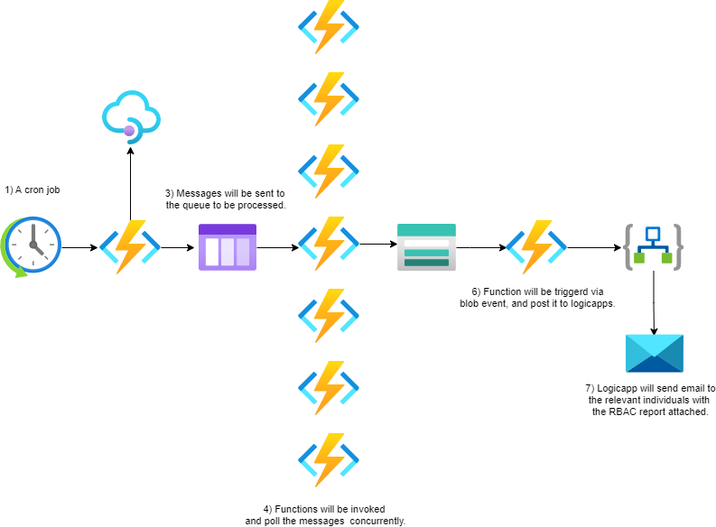
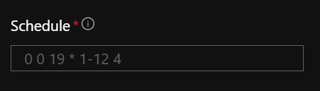
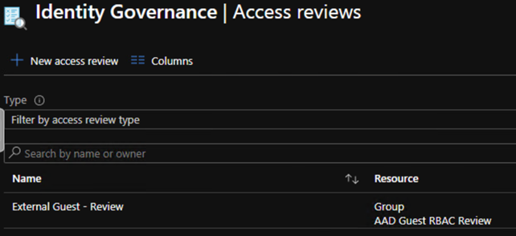
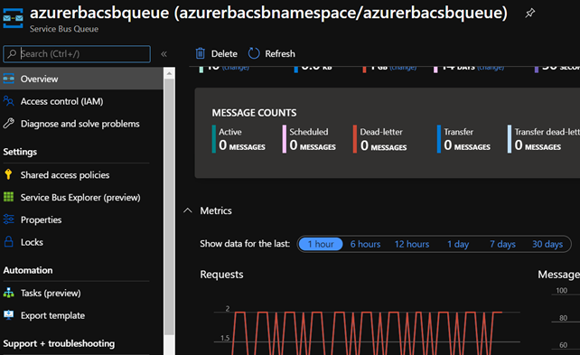
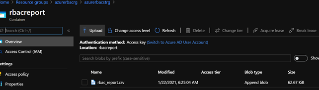
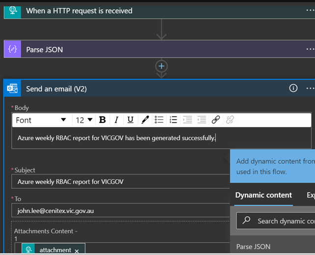

# VICGOV - Azure RBAC Report Workflow
## 1. Introduction
### 1.1	Overview

A number of challenges arise when managing external guest accounts RBAC across significant number of subscriptions, Hosting IaaS teams have been working to make this process easier to maintain going forward.

This document is intended to provide a high level overview of workflow how the automation captures and generates the RBAC report for #EXT# accounts.

Included in this report is a step by step detailed guide around where to look for troubleshooting.

## 2 Logical Architecture
### 2.1	Logical System Component Overview

1. A cron job runs on Friday every week @6am AEDT (ie UTC 7pm Thursday).
    - 

2. Azurerbacfuncapp @GSPINFRA03 gets invoked.
It will
    - iterate thru and grab subscription names & subscription ids and push them into servicebus queue.
    - clean up cloud security group “AAD Guest RBAC Review” which will be used for running identity governance access reviews
    - create a new append block blob which will be used for sending attachment via email.

    - 

3. Servicebus will capture new messages and store them in the queue.
    - 

4. Azurerbacqueuefuncapp will be invoked to poll the messages and process them concurrently.
It will
    - construct UPNs and its assigned roles
    - append the above to the append blob
    - nest UPNs to the security group. (ie AAD Guest RBAC Review)

5. Rbac report will be generated after 60+ function calls complete the process.
    - 

6. Azurerbacsendfuncapp will be triggered and download the content of the report file and post it to logicapp

7. Azurerbaclogicapp will parse the data and send it as attachment to relevant stakeholders
    - 